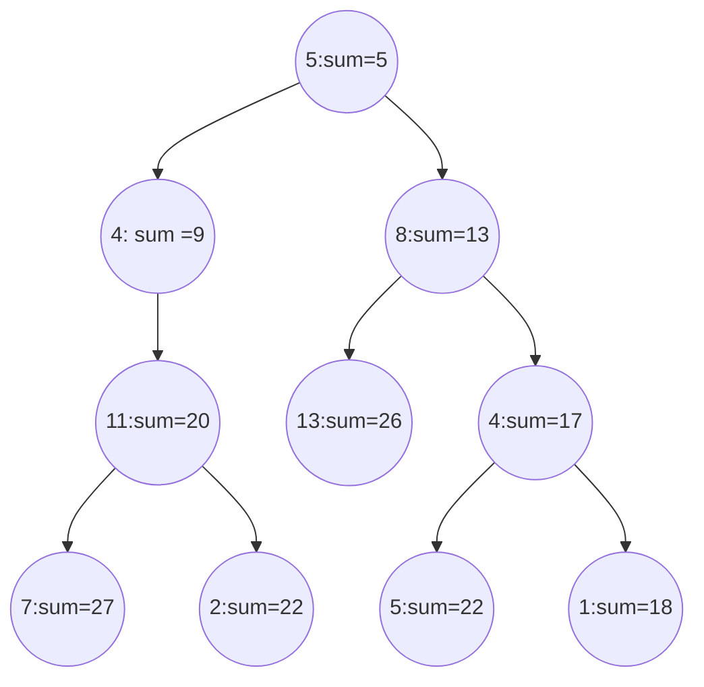

### 1 . Next Greater Element (https://leetcode.com/problems/next-greater-element-i/)

>Problem Rephrase

find the next greater element<br>
give a num1 subset of nums2 -> every integer persent in num1 must be in nums2 , it is not necessary that it will in same order<br>
if next greater element is nums1[i] is not persent in nums2[j] , then -1;
return a array with next greater element

>Data Structures

As we have given two arrays ,and also want to return array<br>
**1 array** to store the next greater elements

>Pattern Detection

Standard problem of **Monotonic Stack**<br>
as need to find the next element and also keep the track of original element for which need to find the next greater elements<br>

>Brute Force Approach

1. loop nums1 -> 0 to n1
2. inside loop of nums1 -> loop nums2 from 0 to n2, find the index for element
3. then in same loop of nums1 , one more loop to find the next elements , if find the next element store that element on index other wise -1


```java
    class solution{
    public int[] nextGreaterElement(int[] nums1[], int[] nums2){
        int n1= nums1.length;
        int n2=nums2.length;
        int[] ans = new int[n1];
        Arrays.fill(ans,-1);
        for(int i=0;i<n1;i++){
            int pos=-1;
            for(int j=0;j<n2;j++){
                if(nums1[i]==nums2[j]){
                    pos=j;
                    break;
                }
            }
            if(pos==-1) continue;
            for(int k=j+1;k<n2;k++){
                if(nums2[k]>nums2[pos]){
                    ans[i]==nums2[k];
                    break;
                }
            }
        }
        return ans;
    }
}
```


>time complexity for brute force 

it will take 0(n1*(0(n2*n2))) in worst case 

> Optimal approach 

Example :-<br>
Input = `nums1[1] = [4,1,2]` , `nums2 = [1,3,4,2]`<br>

Stack = []<br>
Map=[]<br>
Iteration 1 : `nums1=4`<br>
replace nums1[0]=2 index of 4 in nums2

iteration 2 : `nums1=1`
replace nums2[1] = 0;

iteration 3 : `nums1=2` 
replace `nums[2]=3`

new method to find the next greater element array from nums2

stack =[]

iteration from last of the nums2

iteration `n2-1` , `nums2=2`<br>
stack is empty : `push` into stack `stack=[2]`<br>
replace `nums1[n2-1]=-1`

iteration `3` , `nums=4`<br>
stack is not empty; check the top of stack , `2` , is `2>4` ? No
replace `nums2[3] =-1`<br>
**POP** `2` from stack and push 4 to stack = stack [4]

iteration `2` , `nums=3`
stack is not empty; check the top of stack, 4 , is 4>3 > Yes<br>
nums2[2] =4
POP : 4 and add 3 to stack =[3]

iteration 1 , nums=1

stack is not empty , check the top of the stack is 3 , is 3>1 ? Yes 
nums[1] = 3
POP : 3 and push 1 stack =[1]


```java

class solution{
    public int[] nextGreaterElement(int[] nums1, int[] nums2){
        int[] nextGreater = new int[10001];
        Stack<Integer> stack = new Stack<>();
        
        for(int i= nums1.length-1;i>=0;i++){
            while(!stack.isEmpty() && stack.peak()<=nums2[i]){
                stac.pop();
            }
            nextGreater[nums2[i]] = stack.isEmpty()?-1:stack.peak();
            stack.push(nums2[i]);
        }
        for(int i=0;i<nums1.length;i++){
            nums1[i] = nextGreater[nums1[i]];
        }
        return nums1;
    }
}
```


#### Problem 1 : Group Anagrams (https://leetcode.com/problems/group-anagrams/)

> Rephrase the problem

group by anagram 

> Data Structure

HashMap 

> Brute Force 


at each index find the stored of word and put in hasmap <key , List<String>>

sorting will take order 26 and then store each number O(26*n);

```java

import java.util.ArrayList;
import java.util.Map;

class solution {
    public List<List<String>> groupingAnagrams(String[] strs) {
        Map<String, List<String>> map = new ArrayList<>();

        for (int i = 0; i < n; i++) {
            String temp = stored(strs[i]);
            if (map.containsKey(temp)) {
                map.get(temp).add(strs[i]);
            } else {
                List<String> str = new ArrayList<>();
                str.add(strs[i]);
                map.put(temp, str);
            }
        }

        List<List<String>> result = new ArrayList<>();
        for (Map.Entry<String,List<String>> entry : map.entrySet() ){
            result.add(new ArrayList<>(entry.getValue()));
        }
        return result;
    }
    
    private String stored(String str){
        int n = str.length();
        StringBuilder sb = new StringBuilder();
        int[] freq = new int[26];
        for(int i=0;i<n;i++){
            freq[str.charAt(i)-'a']++;
        }
        for(int i=0;i<26;i++){
            if(freq[i]!=0){
                while(freq[i]--!=0){
                    sb.append((char)(i+'a'));
                }
            }
        }
        return sb.toString();
    }
}
```

#### Problem 3 : Path Sum II (https://leetcode.com/problems/path-sum-ii/)

> Rephrase Problem

1. Give `root` and `targetSum`
2. find `root-to-leaf` paths whose sum is `targetSum` 
3. return the list of the node `values`

>Data Structure

List<Integer> as it is return <br>
for operation TreeNode class (Binary Tree)

>Pattern Recognition

traverse the from root to leaf while getting value <br>
node->left-right -> pre-order traversal

> Brute Force



```java
    import java.util.ArrayList;

class TreeNode;

class Solution {
    public List<List<Integer>> pathSum(TreeNode root, int targetSum) {
        List<Integer> ans = new ArrayList<>();
        List<List<Integer>> result = new ArrayList<>();
        dfs(root,targetSum,ans,result,0);
        return result;
    }
    
    private void dfs(TreeNode root, int target, List<Integer> ans, List<List<Integer>> result,int sum){
        if(root==null) return;
        sum +=root.val;
        ans.add(root.val);
        if(root.left==null && root.right==null){
            if(target==sum){
                result.add(new ArrayList<>(ans));
            }
            return;
        }
        dfs(root.left,target,ans,result,sum);
        dfs(root.right,target,ans,result,sum);
        ans.remove(ans.size()-1);
    }
    
}
```


