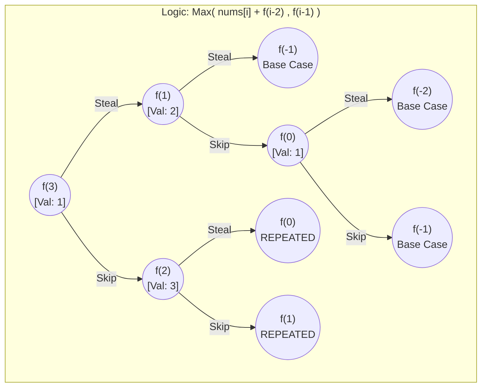

### Problem 1 : Dynamic Programming  House Robber(https://leetcode.com/problems/house-robber/)

>Rephrase the problem 

given a array of house with money , house 1 have nums[1] amount<br>
not allow to steal in adjacent house<br>
maximum amount of money in a single night 

> Data Structure

Array

> Pattern Recognition

Need to find all possible commbination to get the maximum amount , so DP

> Brute Force

1. index that required -> index
2. all possible combination on the index
    steal = nums[index] + f(index-2);
    notSteal = f(index-1);
    need find the max,so max(steal, notSteal)
3. base case -> if index become negative then return 0

##### DRY RUN 

Example 

Input : nums = [1,2,3,1];
Output : 4

end-to-start approach<br>
pick 1 : amount =1;
pick 2 : amount = 1+2 = 3
 loop end : max = 3 

pick 3 : amount = 3;
pick 1 : amount = 1 
loop end : max =4 

so the max =4 

#### Psuedo code 

```java
    int f(index){
    if(index<0) return 0;
    int steal = nums[index] + f(index-2);
    int notSteal = f(index-1);
    return Math.max(steal,notSteal);
}
```


```text
f(3) called (val:1)
|__Option A: Steal (1 + f(1))
|   |__ f(1) called (val:2)
|       |__Option A: steal ( 2+ f(-1)) => Returns 2 + 0 = 2
|        |__Option B: skip f((0))
|           |__ f(0) called (val:1)
|               |__Option A: steal ( 1 + f(-2)) => Returns 1 + 0 = 2
|               |__Option B: skip (f(-1))  => Returns 0
|           |__ Max(1,0) -> Returns 1
|       |__ Max(2,1) -> Return 2
|__Option B: Skip (f(2))
|   |__ f(2) called (val:3)
|       |__Option A : steal (3 + f(0))
|           |__ f(0) called (val:1) =>Repeated Memo f(0) =1 , Returns 3 +1 = 4        
|       |__Option B : skip f(1)
|          |__ f(1) called (val:2)  => Repeated return 2   
|   |__ Max(4,2) -> Return 4

final Result Max(1+2, 4) = 4 Ans           
```

> Optimize it with memoization

```java
    class Solution{
    public int rob(int[] nums){
        int n = nums.length;
        int[] dp = new int[n];
        Arrays.fill(dp,-1);
        return func(n-1,dp,nums);
    }
    
    private int func(int index, int[] dp, int[] nums){
        if(index<0) return 0;
        if(dp[index]!=-1) return dp[index];
        int steal = nums[index] + func(index-2,dp,nums);
        int skip = func(index-1,dp,nums);
        
        return dp[index] = Math.max(steal,skip);
    }
}
```

> Optimize further

```java
private int tabulation(int[] nums, int n){
    int[] dp = new int[n];
    dp[0] = nums[0];
    for(int i=1;i<n;i++){
        int steal = 0;
        int skip =0;
        steal = nums[i];
        if(i>1) steal += dp[i-2];
        skip = dp[i-1];
        
        dp[i] = Math.max(steal,skip);
    }
    return dp[n-1];
}
```

### Problem 3 : Subsets (https://leetcode.com/problems/subsets/)

>Rephrase problem

Given an integer array nums of unique elemets<br>
return all possible subsets and subsets should not be dublicate and it can be of any order

> Examples 

```text
Input : nums = [1,2,3]
Output:
[]
[1]
[1,2]
[1,2,3]
[2]
[2,3]
[3]
```

> Data structure

Array

>Pattern Recognition

All possible combination -> Recursion

>Brute force 

1. index 
2. all possible operation on string
    ans.add(num[index]) //take
    f(index-1);
    f(index-1);
    ans.remove(ans.size()-1) // remove last element
3. base case : return when all the index>=n

>DRY RUN

### pseudo code

```java
   private void backtrack(int index, int[] nums, List<Integer> ans, List<List<Integer>> result){
    if(index==nums.length){
        result.add(new ArrayList<>(ans));
        return;
    }
    
    ans.add(nums[index]);
    backtrack(index+1,nums,ans,result);
    ans.remove(ans.size()-1);
    backtrack(index+1,nums,ans,result);
}
```

```text
f(0) called (val:1) ans=[]
|__ Include 1 : ans :[1] -> call f(1)
|   |__ f(1) called (val:2)
|       |__ Include 2 : ans [1,2] -> call f(2)
|           |__ f(2) called (val:3)
|               |__ Include 3 : ans [1,2,3] -> call f(3)
|                   |__ f(3) called ->Base case -> Result :[[1,2,3]]
|               |__ Exclude 3 : ans [1,2] -> call f(3)
|                   |__ f(3) called -> Base case -> Result :[[1,2,3],[1,2]]
|      |__ Exclude 2: ans:[1] -> cal f(2)
|                   |__ f(2) called (val:3)
|                         |__ Include 3 : ans:[1,3] -> call f(3)
|                             |__ f(3) called -> Base case -> Result :[[1,2,3],[1,2],[1,3]]
|                         |__ Exclude 3 : ans :[1] -> call f(3)
|                             |__ f(3) called -> Base case -> Result :[[1,2,3],[1,2],[1,3],[1]]
|__ Exclude 1 : ans;[] -> call f(1)
   |__ f(1) called (val:2)
        |__ Include 2 : ans [2] -> call f(2)
            |__ f(2) called (val:3)
                   |__ Include 3 : ans :[2,3] -> called f(3)
                       |__ f(3) called -> base case -> Result :[[1,2,3],[1,2],[1,3],[1],[2,3]]
                   |__ Exclude 3 : ans [2] -> called f(3)
                       |__ f(3) called -> base case -> Result : [[1,2,3],[1,2],[1,3],[1],[2,3],[3]]
       |__ Exclude 2 : ans [] -> call f(3)
           |__ f(3) called -> base case -> Result : [[1,2,3],[1,2],[1,3],[1],[2,3],[2],[3],[]]                          
                                                                                                                                                             
```

