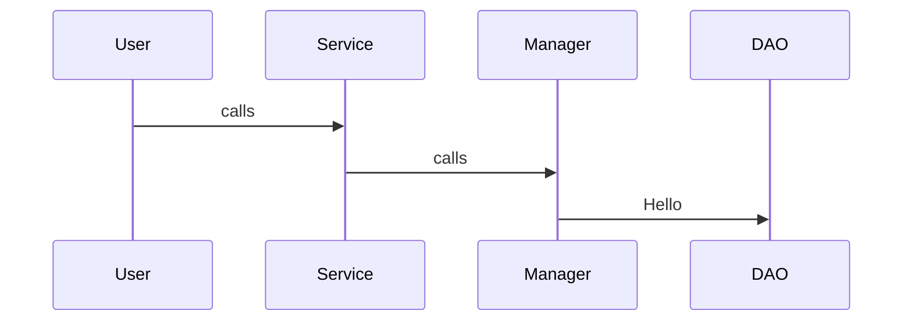

# General Approach for HLD

## 1. Clarify Requirements
Ask functional + non-functional questions
1. what features?
2. Real-time or eventual consistency?
3. Scale? Users per day? QPS?
4. Latency target?
5. Read-heavy or write-heavy?

## 2. Define APIs & Use Cases

## 3. Estimate Scale(Assumptions)
Define:
1. Traffic
2. Storage
3. QPS
4. Bandwidth
5. Growth

## 4. High-Level Architecture

Always include:
1. Load balancer
2. API gateway
3. Services
4. Databases
5. Cache
6. Messaging Queues
7. CDN
8. Distributed storage

## 5 Database + Storage Domain
Decide : 
1. SQL or NoSQL
2. Sharding
3. Replication
4. Partition
5. Indexing strategies

## 6. Detailed Component Design
Explain internals of 
1. Feed service
2. Chat service
3. Search service
4. Notification service

## 7. Scalability + Consistency
cover:
1. Caching strategy
2. Queue-based async processing
3. Eventual consistency
4. Leader/follower replication
5. Multi-region deployment

## 8. Bottlenecks + Improvements
Add: 
1. Rate Limiting
2. Circuit breakers
3. Auto-scaling
4. Observability(logs,metrics,tracing)


# General Approach for LLD

## 1. Clarify Requirements
Functional +constraints:
1. Entities
2. Operations
3. Rules
4. Constraints
5. Edge cases

## 2. Identify Core Entities(classes)
Example - Parking lot:
1. ParkingLot
2. Vehicle
3. Ticket
4. Spot
5. Floor


## 3. Define Relationships
Use: 
1. Composition
2. Aggregation
3. Inheritance
4. Interface segregation

## 4. Define Class Responsibilities
Follow SOLID principles:
1. Single Responsibility
2. Open/closed
3. Interface segregation
4. Dependency Inversion

## 5 Write Class Diagram
Include:
1. Methods
2. Attributes
3. Associations
4. Multiplicity

## 6. Define Key Interfaces
Examples:
```java
    interface PaymentProcessor
    interface NotificationService
    interface StorageService
```

## 7 Add Sequence Diagram/Flow
Demostrate message calls:


## 8. Discuss Extensibility + Design Choices
Mention:
1. Why composition over inheritance
2. Why interface-based design
3. why factory pattern
4. How to add new features


# DAY TO DAY PRACTICES

## DAY 1
- [ ] HLD : URL Shortener(TinyURL)
- [ ] LLD : Parking Lot System

## DAY 2
- [ ] HLD : Instagram
- [ ] LLD : Elevator System

## DAY 3
- [ ] HLD : WhatsApp/char system
- [ ] LLD : Library Management System

## DAY 4
- [ ] HLD : Twitter Feed System
- [ ] LLD : Movie Ticket Booking System

## DAY 5
- [ ] HLD : Uber/Lyft System
- [ ] LLD : Logging framework

## DAY 6
- [ ] HLD : YouTube/Video Streaming
- [ ] LLD : Airline Reservation System

## DAY 7
- [ ] HLD : Notification System
- [ ] LLD : Vending Machine

## DAY 8
- [ ] HLD : Amazon/Flipkart
- [ ] LLD : Snake & Ladder

## DAY 9
- [ ] HLD : Payment Gateway(Razorpay/Stripe)
- [ ] LLD : Chess Game/Tic-Tac-Toe

## DAY 10
- [ ] HLD : Google Drive
- [ ] LLD : ATM Machine

## DAY 11
- [ ] HLD : Zoom/Video Conferencing
- [ ] LLD : Hotel Booking System

## DAY 12
- [ ] HLD : Real-Time Locating Tracking
- [ ] LLD : Splitwise

## DAY 13
- [ ] HLD : News Feed System
- [ ] LLD : Inventory Management

## DAY 14
- [ ] HLD : Distributed Cache(Redis)
- [ ] LLD : Cab/Taxi Management System

## DAY 15
- [ ] HLD : Search Autocomplete
- [ ] LLD : In-Memory key value store

## DAY 16
- [ ] HLD : Messaging Queue(Kafka Lite)
- [ ] LLD : File System Design

## DAY 17
- [ ] HLD : Email Service(Gmail Lite)
- [ ] LLD : Logging Rate Limiter

## DAY 18
- [ ] HLD : Distributed Locking System
- [ ] LLD : Cricbuzz Scoreboard System

## DAY 19 
- [ ] HLD : URL Crawling System
- [ ] LLD : Bowling Alley System

## DAY 20 
- [ ] HLD : Zoom Whiteboard
- [ ] LLD : Bidding / Auction System

## DAY 21
- [ ] HLD : Food Delivery System(zomato/swiggy)
- [ ] LLD : Music Player Design

## DAY 22
- [ ] HLD : Reddit/Discussion Forum
- [ ] LLD : Cricket Dashboard Model

## DAY 23
- [ ] HLD : Ride Matching Algorithm(Uber)
- [ ] LLD : Restaurant Reservation System

## DAY 24
- [ ] HLD : Fraud Detection System
- [ ] LLD : Elevator System(Hard Variant)

## DAY 25
- [ ] HLD : Multi-Region Deployment Strategy
- [ ] LLD : Digital Wallet(PhonePe/Paytm)

## DAY 26 
- [ ] HLD : Food Recommendation Engine
- [ ] LLD : Documentation Versioning System

## DAY 27
- [ ] HLD : IoT Device Control System
- [ ] LLD : Payment Retry Service

## DAY 28
- [ ] HLD : Multi-Tenant SaaS Architecture
- [ ] LLD : Order Management System

## DAY 29
- [ ] HLD : Google Maps(Route service)
- [ ] LLD : Car Rental System

## DAY 30 
- [ ] HLD : Design Netflix
- [ ] LLD : Message Rate Limiter(Token Bucket)
