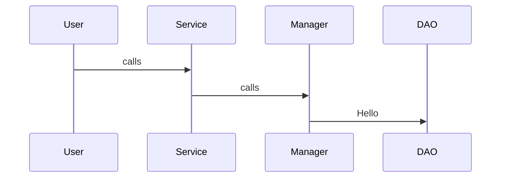

# General Approach for HLD

## 1. Clarify Requirements
Ask functional + non-functional questions
1. what features?
2. Real-time or eventual consistency?
3. Scale? Users per day? QPS?
4. Latency target?
5. Read-heavy or write-heavy?

## 2. Define APIs & Use Cases

## 3. Estimate Scale(Assumptions)
Define:
1. Traffic
2. Storage
3. QPS
4. Bandwidth
5. Growth

## 4. High-Level Architecture

Always include:
1. Load balancer
2. API gateway
3. Services
4. Databases
5. Cache
6. Messaging Queues
7. CDN
8. Distributed storage

## 5 Database + Storage Domain
Decide : 
1. SQL or NoSQL
2. Sharding
3. Replication
4. Partition
5. Indexing strategies

## 6. Detailed Component Design
Explain internals of 
1. Feed service
2. Chat service
3. Search service
4. Notification service

## 7. Scalability + Consistency
cover:
1. Caching strategy
2. Queue-based async processing
3. Eventual consistency
4. Leader/follower replication
5. Multi-region deployment

## 8. Bottlenecks + Improvements
Add: 
1. Rate Limiting
2. Circuit breakers
3. Auto-scaling
4. Observability(logs,metrics,tracing)


# General Approach for LLD

## 1. Clarify Requirements
Functional +constraints:
1. Entities
2. Operations
3. Rules
4. Constraints
5. Edge cases

## 2. Identify Core Entities(classes)
Example - Parking lot:
1. ParkingLot
2. Vehicle
3. Ticket
4. Spot
5. Floor


## 3. Define Relationships
Use: 
1. Composition
2. Aggregation
3. Inheritance
4. Interface segregation

## 4. Define Class Responsibilities
Follow SOLID principles:
1. Single Responsibility
2. Open/closed
3. Interface segregation
4. Dependency Inversion

## 5 Write Class Diagram
Include:
1. Methods
2. Attributes
3. Associations
4. Multiplicity

## 6. Define Key Interfaces
Examples:
```java
    interface PaymentProcessor
    interface NotificationService
    interface StorageService
```

## 7 Add Sequence Diagram/Flow
Demostrate message calls:


## 8. Discuss Extensibility + Design Choices
Mention:
1. Why composition over inheritance
2. Why interface-based design
3. why factory pattern
4. How to add new features


# DAY TO DAY PRACTICES

## DAY 1
- [ ] HLD : URL Shortener(TinyURL)
- [ ] LLD : Parking Lot System

## DAY 2
- [ ] HLD : Instagram
- [ ] LLD : Elevator System

## DAY 3
- [ ] HLD : WhatsApp/char system
- [ ] LLD : Library Management System

## DAY 4
- [ ] HLD : Twitter Feed System
- [ ] LLD : Movie Ticket Booking System
