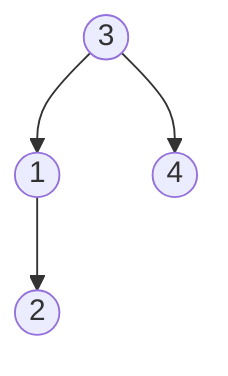
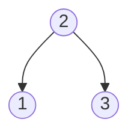

# 1382. Balance a Binary Search Tree

Binary search tree :-> left subtree is smaller than the node and right subtree is greater than the node <br>

````mermaid
graph TD
A((1)) --> B((2))
B --> C((3))
C --> D((4))
````
**Answer can be**
````mermaid
graph TD
A((2)) --> B((1))
A --> C((3))
C --> D((4))
````
**OR**


**Example 2**


**it self is balance tree , ans is same 


## Intuition

1. check if the given tree is already a balanced search tree , return same 
2. we already have a binary search tree , so all are in sorted order in post-order traversal, find the median or middle number make it root node and all above will become the left-subtree and all the below will become the right subtree, then do the same for left subtree and right subtree<br>

> Check will require extra O(n) time and space so instead of checking always make create a balance subtree


## Steps 

1. Take a list and add all node in the list using inorder traversal
 ```mermaid
    block-beta
        1
        2
        3
        4
```
2. now construct the balance-binary search tree<br>
    loop -> it 
        middle = (l + r)/2;
        root = middle;
        root.left = constructBalancedBST(0,middle-1,list);
        root.right = constructBalanceBST(middle+1,r,list); 


```java
class Solution{
    List<Integer> nums;
    public TreeNode balanceBST(TreeNode root){
        nums = new ArrayList<>();
        getNumbers(root);
        TreeNode res = balanceTree(0,nums.size()-1);
        return res;
    }
    
    private void getNumbers(TreeNode node){
        if(node==null) return;
        getNumbers(node.left);
        nums.add(node.val);
        getNumbers(node.right);
    }
    
    private TreeNode balanceTree(int l,int r){
        if(l>r)return null;
        int middle = l +(r-l)/2;
        TreeNode res = new TreeNode(nums.get(middle));
        res.left=balanceBST(l,middle-1);
        res.right=balanceBST(middle+1,r);
        return res;
    }
}
```
> Time Complexity : O(N) , space complexity : O(N)