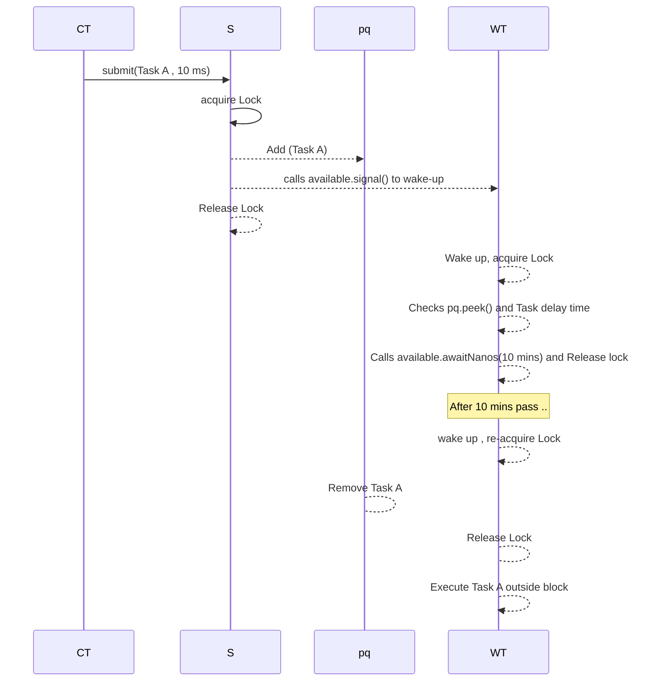

# Delayed Task Schedular

## Step 1 : Requirement clarification(scope and constraints)

1. Functional Requirements : execute tasks pr after scheduled time
2. Non-functional Requirements: there should no busy wait , thread safe operations.in-memory , in single system

## Step 2 : Interface design

1. method for submit the task to schedular

````java
void submit(Task task);
void run();
void shutDown();
````

## Step 3 : High-Level Diagram

1. **The storage problem : "where do we put the tasks?"**<br>
   **Attempt 1(A simple list)**<br>
    Idea : add all the list in arrayList<br>
    need to find : the which task need to is latest , and finding in ArrayList<Task> will take all O(n) time , need to find a DS that will give the current to nearest task,then use (min-heap) **PriorityQueue**<br>
2. **The Concurrency Problem: "What if we add a task while sleeping?"**<br>
    **Attempt 1(Thread.sleep)**<br>
    Idea : The workers sees the next task is in 1 hr , so add thread.sleep(1 hr).<br>
    Problem: 5 mins later, a user submits a new urgent task that's due in 10 mins. the worker is dead for next 55 mins and will the urgent task.
    Soln : we need to interrupt the sleep if a new task , earlier task arrives
    Result : **Conditions variables(`await()`and`signal()`**). This allows worker to wake if required
3. **Thread-safety: when two threads try to submit the task at a time?**
    Idea : need to allow one worker to work on the queue at a time 
    Solution: `synchronized` or `ReentrantLock`

**Components**
1. `PriorityQueue` for solving the storing
2. Worker Thread solve the execution problem
3. `Condition (await() ,signal())` solve the wake-up problem.
4. `Lock` solves the race condition


### Follow-up questions
1. **What happens if 100 threads call `submit()` at a time?**<br>
    Only one thread will acquire the Lock , other 99 threads will be blocked(put to sleep by the OS).Even though we have mulitple core CPU,the submision will happen one by one.**Context Switching** will waste OS CPU time putting threads to sleep and waking them up just to do a tiny insertion<br>
    **Impact**<br>
    Latency : The 100th thread need to wait till the 99th thread finished.<br>
    ````
   Latency ~ 99 X (lock(T) + insert(T) + unlock(T))
   ````
   Throughput : it will decrease 

    **Solution: Segment Locking or virtual thread**

**The Solution:** Break the single lock into multiple smaller locks.

**How it works:**

1. **Create Multiple Queues:** Instead of 1 global `PriorityQueue`, create an array of them (e.g., 16 segments).
2. **Assign Tasks:** Use hashing to determine which queue a task goes into.
```java
int segmentIndex = task.hashCode() % 16;
segments[segmentIndex].lock.lock();
segments[segmentIndex].queue.offer(task);

```


3. **Parallel Access:** Thread A can write to Segment 0 *while* Thread B writes to Segment 1. They don't block each other!

**Benefits:**

* **Reduced Contention:** 100 threads split across 10 segments means only ~10 threads fighting per lock.
* **Higher Throughput:** Multiple insertions happen in parallel.

**Trade-off:**

* **Complexity:** The "Dispatcher" now needs to check *all* 16 queues to find the globally earliest task. (Usually solved by having 16 separate worker threads, one per queue).

---

#### 3. Optimization B: Java 21 Virtual Threads (Project Loom)

**The Question:** *"How does Java 21 change this?"*

* **Old Way (Platform Threads):**
* Heavy (2MB RAM each).
* Limited (Can only have ~5,000 active threads before crashing).
* Blocking a platform thread is expensive.


* **New Way (Virtual Threads):**
* Lightweight (Bytes).
* Scalable (Can have **millions**).
* **Cheap Blocking:** When a Virtual Thread waits for a lock, it "unmounts" from the CPU. The underlying OS thread immediately picks up another task.


**Impact on Our Scheduler:**
If 100 (or 10,000) Virtual Threads hit the lock:

1. They don't consume OS resources while waiting.
2. The application remains responsive.
3. **Throughput increases** because the CPU is never idle waiting for IO or locks; it just switches to the next available Virtual Thread instantly.

**Key Interview Phrase:**

> *"Virtual Threads decouple 'tasks' from 'OS threads'. We can handle high concurrency without the memory overhead of traditional thread pools."*

---

### 📝 Summary Table: Optimization Strategies

| Strategy | Pros | Cons | Best For |
| --- | --- | --- | --- |
| **Single Lock (Base)** | Simple code, strict ordering. | Low throughput under high load. | Low-traffic systems. |
| **Lock Striping** | High throughput, parallel writes. | Complex `poll()` logic (checking multiple queues). | High-traffic, CPU-bound systems. |
| **Virtual Threads** | Massive scalability, simple code (looks synchronous). | Doesn't fix the *logic* bottleneck (still one queue), just cheaper waiting. | IO-bound, high-concurrency apps (Java 21+). |

--- 

## Step 4: deep dive : Data structure 
We need a data structure for fast insert and peek/poll<br>
1. **`PriorityQueue`** is one of the choice
    **Internal Structure:**<br>
    it act as Binary tree but store data as array.<br>
    **Root:** Index 0 (always smallest)<br>
    **Children of `i` : stored at `2i+1` and `2i-1`<br>
    **Parent of `i`: stored at `(i-1)/2`<br>

    

## Step 5: Deep dive : Execution & Scaling
## Step 6 : Fault Tolerance & Reliability

    
   
   
